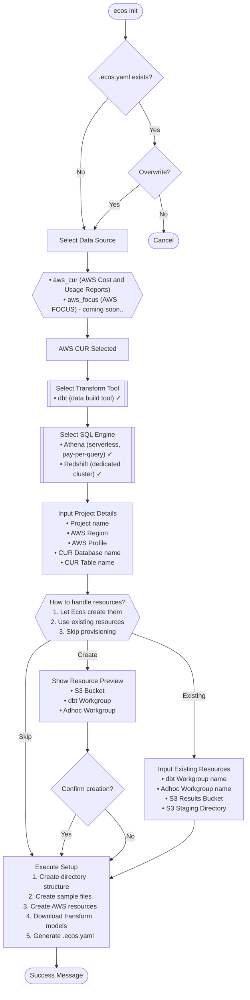

# ECOS CLI Menu Structure & User Flow Documentation

## 📋 Table of Contents
1. [Command Tree Structure](#command-tree-structure)
2. [Interactive User Flows](#interactive-user-flows)
3. [UI Elements & Styling](#ui-elements--styling)
4. [Text & Naming Inventory](#text--naming-inventory)
5. [Configuration Options](#configuration-options)

---

## 🌳 Command Tree Structure

```
ecos
├── init                     # Initialize a new ecos project
│   ├── --force (-f)        # Overwrite existing files without prompting
│   ├── --output (-o)        # Output directory for the project
│   ├── --skip-prereq        # Skip prerequisite checks
│   ├── --source (-s)        # Data source to configure
│   └── --model-version (-m) # Version of ecos models to use
│
├── ingest                   # Ingest cloud billing data [PLACEHOLDER]
│   ├── --source (-s)        # Data source to ingest from
│   ├── --output-table (-o)  # Override output table destination
│   ├── --start-date         # Start date for ingestion (YYYY-MM-DD)
│   ├── --end-date           # End date for ingestion (YYYY-MM-DD)
│   ├── --validate-only (-v) # Validate without ingesting
│   └── --config (-c)        # Additional config key=value pairs
│
├── transform                # Transform cloud cost data
│   ├── [command]            # dbt command to run (run, test, seed, etc.)
│   ├── --project-dir (-p)   # ecos project directory path
│   └── --dry-run            # Show what would be executed
│
├── verify                   # Verify setup readiness [COMING SOON]
│
├── version                  # Display version information
│   └── --verbose (-v)       # Detailed version information
│
└── Global Flags
    ├── --config             # Config file (default: .ecos.yaml)
    ├── --dry-run            # Show what would be done
    └── --help (-h)          # Show help information
```

### Command Status Legend
- ✅ **Fully Implemented**: `init`, `transform`, `version`
- ⚠️ **Placeholder**: `ingest` (displays planned functionality)
- 🚧 **Coming Soon**: `verify`

---

## 🔄 Interactive User Flows

### 1. `ecos init` Flow



### 2. `ecos ingest` Flow [Placeholder]

```
ecos ingest
    │
    ├── Source Selection (if not provided)
    │   └── Select: AWS CUR / GCP Billing / Azure Cost
    │
    └── Display Placeholder Message
        └── Show Planned Steps:
            1. Validate connection
            2. Fetch billing data
            3. Process & validate quality
            4. Store in destination
```

### 3. `ecos transform` Flow

```
ecos transform [command]
    │
    ├── Parse Arguments
    │   ├── Extract ecos flags (--project-dir, --dry-run)
    │   └── Pass through tool-specific flags
    │
    ├── Load Configuration
    │   ├── Check .ecos.yaml exists
    │   └── Determine transform plugin (default: dbt)
    │
    └── Execute Transform
        ├── Validate plugin configuration
        └── Run dbt command with output streaming
```

### 4. `ecos verify` Flow [Coming Soon]

```
ecos verify
    │
    └── Display Coming Soon Message
        └── List planned checks:
            • Cloud provider credentials
            • Plugin configuration
            • Data source connectivity
            • Transform tool setup
```

---

## 🎨 UI Elements & Styling

### Color Scheme

| Element | Color Code | ANSI | Usage |
|---------|------------|------|-------|
| **Reset** | `\033[0m` | Reset | End color formatting |
| **Red** | `\033[31m` | Error | Errors, failures |
| **Green** | `\033[32m` | Success | Success messages, checkmarks |
| **Yellow** | `\033[33m` | Warning | Warnings, prompts |
| **Blue** | `\033[34m` | Info | Information, headers |
| **Purple** | `\033[35m` | SubHeader | Section headers |
| **Cyan** | `\033[36m` | Accent | Commands, highlights |
| **White/Gray** | `\033[37m` | Debug | Verbose output |

### Visual Elements

#### Progress Indicators
```
Spinner:    ⠋ ⠙ ⠹ ⠸ ⠼ ⠴ ⠦ ⠧ ⠇ ⠏ (animated)
Progress:   [████████░░░░░░░░░░░░] 40% Message
Status:     ✔ Success  ✗ Error  ! Warning  i Info
Dry Run:    [DRY RUN] Would perform action
```

#### Headers & Formatting
```
Main Header:    🚀 ecos init
Section:        ━━━━━━━━━━━
Step Counter:   (1/4) Creating directory structure
Progress:       [•] Running operation...
```

### Prompt Styles

| Type | Format | Example |
|------|--------|---------|
| **Select** | Arrow navigation | `? Select your data source` |
| **Input** | Text entry with default | `Project name (default: my-cost-analysis):` |
| **Confirm** | Yes/No | `? Do you want to proceed? (yes/no):` |
| **Yes/No** | Selection | `[Yes] No` |

---

## 📝 Text & Naming Inventory

### Main Command Descriptions

| Command | Short | Long |
|---------|-------|------|
| **ecos** | "A cloud-agnostic CLI tool for cloud billing and optimization data management" | Full description with architecture details |
| **init** | "Initialize a new ecos project for cloud cost analysis" | Includes key features and what gets created |
| **ingest** | "Ingest cloud billing data for cost analysis" | Details about data sources and process |
| **transform** | "Transform cloud cost data using configured transformation tools" | Wrapper explanation with examples |
| **verify** | "Verify that ecos setup is ready to execute (coming soon)" | Placeholder with planned features |
| **version** | "Display version information" | Simple version display |

### Interactive Prompts

#### Init Command Prompts
1. **Data Source**: "Select your data source"
2. **Transform Tool**: "Which transformation tool would you like to use?"
3. **SQL Engine**: "SQL engine (Available for AWS + [tool])"
4. **Project Name**: "Project name"
5. **AWS Region**: "AWS Region"
6. **AWS Profile**: "AWS Profile"
7. **CUR Database**: "CUR Database name"
8. **CUR Table**: "CUR Table name"
9. **Resource Handling**: "How would you like to handle transform resources?"
10. **Confirmation**: "Do you want to proceed with creating these resources?"

#### Resource Options
- "Let Ecos create them (recommended)"
- "Use my existing resources"
- "Skip provisioning (IaC/manual)"

### Status Messages

#### Success Messages
- "✔ Configuration file created"
- "✔ Cloud resources created successfully"
- "✔ Transform models downloaded successfully"
- "✔ [plugin] [command] completed successfully"

#### Error Messages
- "✗ Failed to create directory structure"
- "✗ Resource creation failed"
- "✗ Plugin validation failed"
- "✗ Missing prerequisites: [list]"

#### Warning Messages
- "! An ecos project already exists"
- "! No .ecos.yaml found, using default configuration"
- "! Resource creation failed - manual setup required"

#### Info Messages
- "i Using config file: [path]"
- "[v] Verbose output message"
- "[DRY RUN] Would perform action"

### Table Headers

| Context | Headers |
|---------|---------|
| **Resource Preview** | Type, Name |
| **Prerequisites** | Component, Status |
| **Version Info** | Component, Version |

---

## ⚙️ Configuration Options

### Global Flags

| Flag | Short | Default | Description |
|------|-------|---------|-------------|
| `--config` | - | `.ecos.yaml` | Config file path |
| `--dry-run` | - | `false` | Show what would be done without executing |
| `--help` | `-h` | - | Show help information |
| `--version` | - | - | Show version information |

### Init Command Flags

| Flag | Short | Default | Description |
|------|-------|---------|-------------|
| `--force` | `-f` | `false` | Overwrite existing files without prompting |
| `--output` | `-o` | `.` | Output directory for the project |
| `--skip-prereq` | - | `false` | Skip prerequisite checks (for testing) |
| `--source` | `-s` | - | Data source (aws_cur, aws_focus) |
| `--model-version` | `-m` | `latest` | Version of ecos models to use |

### Ingest Command Flags

| Flag | Short | Default | Description |
|------|-------|---------|-------------|
| `--source` | `-s` | - | Data source to ingest from |
| `--output-table` | `-o` | - | Override output table destination |
| `--start-date` | - | - | Start date (YYYY-MM-DD) |
| `--end-date` | - | - | End date (YYYY-MM-DD) |
| `--validate-only` | `-v` | `false` | Validate without ingesting |
| `--config` | `-c` | `[]` | Additional config key=value pairs |

### Transform Command Flags

| Flag | Short | Default | Description |
|------|-------|---------|-------------|
| `--project-dir` | `-p` | `.` | ecos project directory path |
| `--dry-run` | - | `false` | Show what would be executed |

### Version Command Flags

| Flag | Short | Default | Description |
|------|-------|---------|-------------|
| `--verbose` | `-v` | `false` | Display detailed version information |

---

## 🔧 Customization Guide

### To Modify Text/Names:

1. **Command Names**: Update in `cmd/root.go` and respective command files
2. **Descriptions**:
   - Short: Update `Short` field in cobra.Command
   - Long: Update `Long` field in cobra.Command
3. **Prompt Text**: Update in command files (e.g., `cmd/init.go:79-343`)
4. **Status Messages**: Update in `utils/output.go` helper functions
5. **Colors**: Modify color constants in `utils/output.go:14-26`
6. **Emojis**: Update directly in command files and output functions

### Key Files for UI Customization:

- **Command Definitions**: `/cmd/*.go`
- **UI Utilities**: `/utils/output.go`
- **Plugin Interfaces**: `/plugins/core/init/*.go`
- **Config Types**: `/config/types.go`

### Example Modifications:

#### Change Command Name:
```go
// In cmd/init.go
var initCmd = &cobra.Command{
    Use:   "setup",  // Changed from "init"
    Short: "Setup a new ecos project",  // Updated description
    ...
}
```

#### Change Prompt Text:
```go
// In cmd/init.go:79
i, _, err := utils.PromptSelect("Choose your cloud provider", sourceOptions, 0)
// Changed from "Select your data source"
```

#### Change Status Symbol:
```go
// In utils/output.go:61
func PrintSuccess(msg string) {
    fmt.Printf("%s✅%s %s\n", ColorGreen, ColorReset, msg)
    // Changed from ✔ to ✅
}
```

---

## 📊 User Experience Flow Summary

### Typical User Journey

1. **Installation** → User installs ecos CLI
2. **Initialization** → `ecos init` to set up project
   - Select data source
   - Configure cloud provider
   - Set up resources
3. **Configuration** → Review/edit `.ecos.yaml`
4. **Transformation** → `ecos transform run` to process data
5. **Verification** → `ecos verify` to check setup (future)
6. **Ingestion** → `ecos ingest` for new data (future)

### Decision Points

1. **Overwrite existing project?** → Yes/No
2. **Select data source** → AWS/Azure/GCP
3. **Resource handling** → Create/Use Existing/Skip
4. **Confirm resource creation** → Yes/No

### Error Recovery Paths

- **Missing prerequisites** → Show installation instructions
- **Config not found** → Use defaults or prompt to run init
- **Resource creation fails** → Continue with manual setup option
- **Transform fails** → Show detailed error with suggestions
